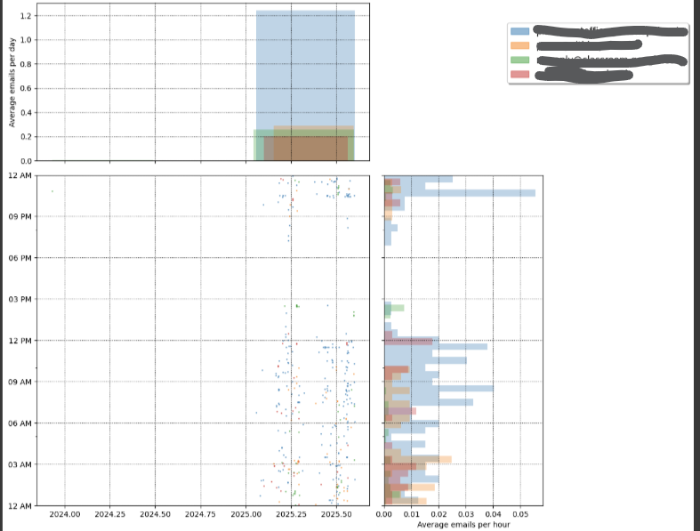
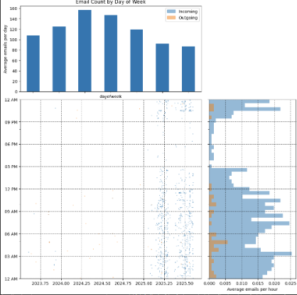
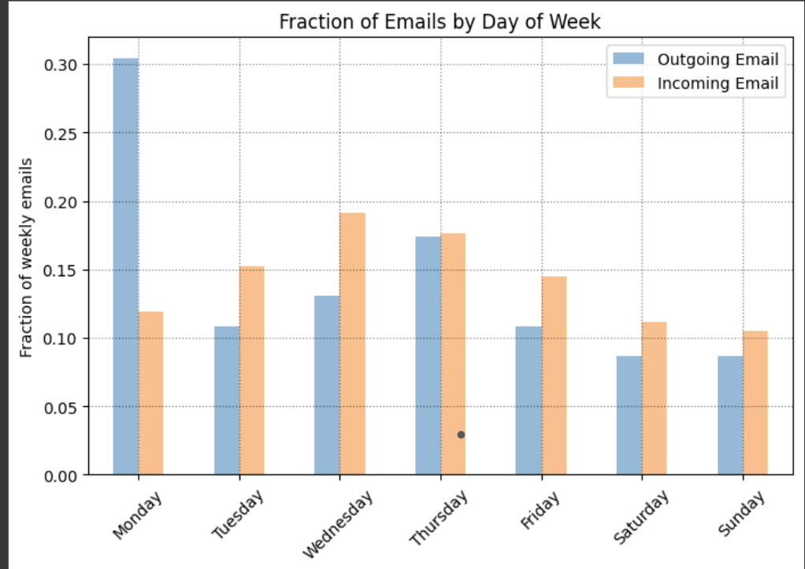

# Email Classification with Multilayer Perceptron (MLP) using TensorFlow

This mini project explores email spam classification using a Multilayer Perceptron (MLP) neural network built with TensorFlow. The goal is to learn practical applications of neural networks by building a working text classification model that detects spam based on keywords in emails.

## Why This Project?

This is designed for hands-on learning and skill development in machine learning and natural language processing (NLP). It helps build understanding of:

- Processing and cleaning real-world email data.
- Feature extraction and text vectorization for ML models.
- Designing and training simple neural networks with TensorFlow.
- Evaluating model performance on classification tasks.
- Generating useful visual insights from data.

## Features

- Email data parsing from mbox files using Python's `mailbox` library.
- Data preprocessing including text cleaning and time zone normalization.
- Visualizations showing email sending patterns and sender analysis.
- Spam/ham classification with a simple MLP with one hidden layer of 3 neurons.
- Learning focused on fundamentals of neural networks and TensorFlow workflows.

## Tech Stack

| Technology                                                                 | Purpose                  |
|---------------------------------------------------------------------------|--------------------------|
|                | Programming language     |
|    | Neural network framework |
|                | Data manipulation        |
|    | Visualizations           |
|                                    | Email parsing            |
|                                | Word cloud generation    |
|                                          | Timezones handling       |

## Installation

Make sure you have Python 3.7+ installed. Install the required packages using pip:

pip install numpy pandas matplotlib mailbox wordcloud pytz tensorflow

## Usage

1. Download your email mbox files (`Inbox.mbox` and `Sent.mbox`).
2. Update the file paths in the script to point to the local mbox files.
3. Run the script or Jupyter notebook:
python mlp_email_spam_classifier.py
4. View the training output and final evaluation accuracy.

## File Structure

├── Inbox.mbox # Inbox emails in mbox format  
├── Sent.mbox # Sent emails in mbox format  
├── mlp_email_spam_classifier.py # Main script with processing, modeling, and evaluation  
├── README.md # This file  
└── requirements.txt # Python dependencies (optional)  

## Results

The model achieves 100% accuracy on this curated dataset of first 50 emails from inbox and sent folders merged, demonstrating successful keyword-based spam classification.

## Output and Visualizations

Below are some key plots generated by the model:

### Average Emails per Hour

### Email Count by Day of Week

### Fractions of Emails by Day of Week (Sent vs Received)

## Notes

- This project serves as a learning tool focusing on the basics of neural networks and NLP.
- For production use, consider larger datasets and more advanced text processing techniques.
- Do **not** upload your personal email mbox files if publishing publicly; use sanitized sample data instead.

## License

This project is licensed under the MIT License - see the LICENSE file for details.

---

Created by Purvi as part of personal learning and skill development.

